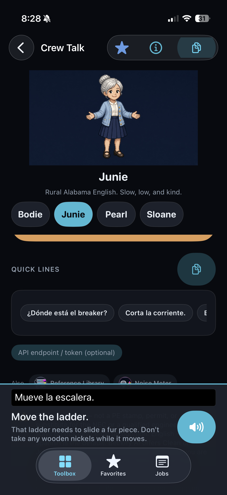
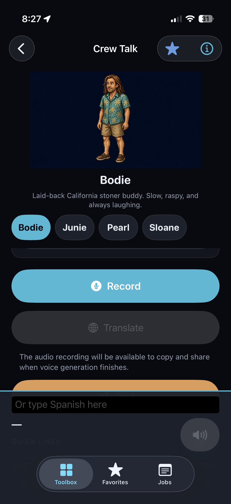
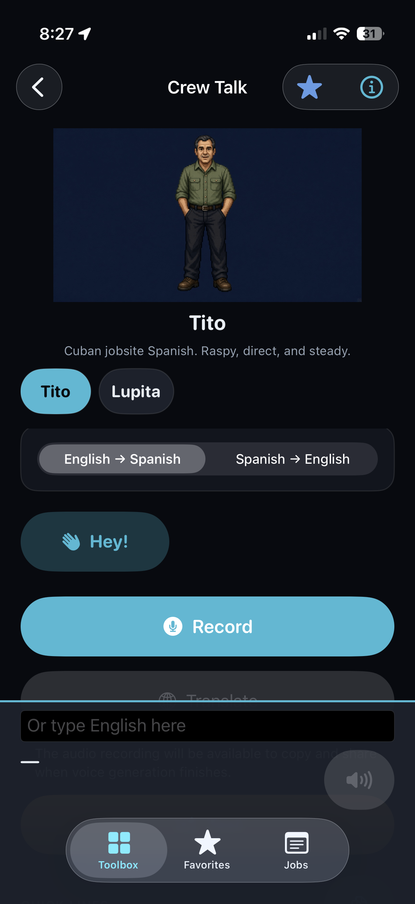
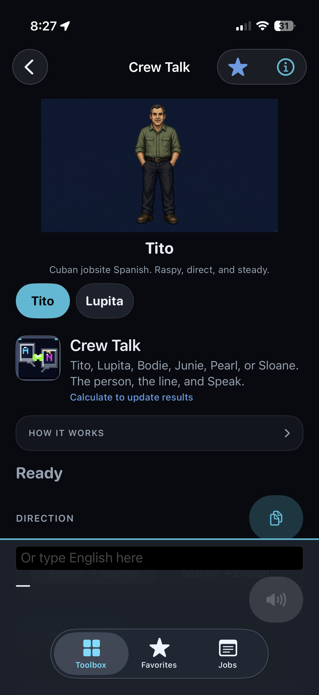
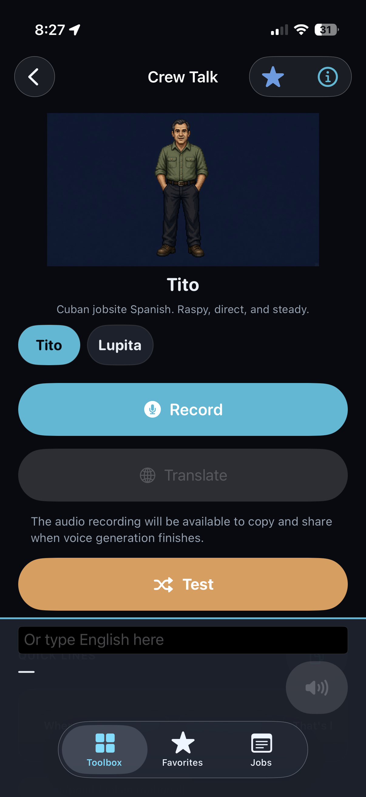

# WP-0B — Crew Talk layout repro (Quick lines / Speak / TextField / tab bar)

Tip investigated: `f68b8a5044bb6afed09fa151835dd0d38cd3fe6b` (`main`).
Scheme: Beckify only. No MARKETING_VERSION / CURRENT_PROJECT_VERSION bump.

## Evidence (phone shots)

Cos confirmed the symptoms from Trevor’s five phone screenshots, taken about 8:27–8:28 PM (status bar). Phone model and Dynamic Type are unlabeled; the keyboard is **down** in every shot. No Xcode Simulator matrix was captured, and it is **optional**, not required for merge acceptance, now that these device shots provide the repro evidence.

| File | What it shows |
| --- | --- |
| `ios/docs/wp0b-evidence/01-junie-dock-over-tabbar.png` | Junie. Translation + dialect helper + Speak sit in the bottom plate. That plate runs through the floating Toolbox / Favorites / Jobs pill. |
| `ios/docs/wp0b-evidence/02-bodie-field-over-tabbar.png` | Bodie. Text field on the dock plate; plate continues through the tab pill. “QUICK LINES” is under the field. |
| `ios/docs/wp0b-evidence/03-tito-field-over-tabbar.png` | Tito. Field on the same plate over the tab pill. Translate and the recording-availability line are cut by the plate. |
| `ios/docs/wp0b-evidence/04-tito-scroll-quicklines-clipped.png` | Tito scrolled. Direction (and the card under it) is cut on the dock’s top rule. Quick lines are not in the clear. |
| `ios/docs/wp0b-evidence/05-tito-test-bar-over-dock.png` | Tito. Orange Test button is the last control fully above the dock. The dock still covers the tab pill. |

### What the pixels confirm

Measured on shot 02 (same geometry on the other four):

- Accent rule at the top of the dock: **y ≈ 677 pt** (the 2 pt `Theme.accent` bar on `composerDock`).
- Text field: about **688–715 pt**.
- Speak / answer row: about **725–781 pt**.
- Floating tab pill: about **792–853 pt**, icons around **803 pt**. Screen height **874 pt**.
- Dock fill `Theme.surfaceRaised` dark `(28, 34, 44)` is full width from the accent rule **through the pill to the bottom edge**.

So the field glyphs sit just above the pill, and the dock **plate** is drawn through the pill. With a translation on screen (shot 01) the answer text reaches about **773 pt**, ~15 pt above the pill. The pill is painted on top of that plate (the icons stay visible). That is the “dock over the tab bar” in these shots.

The scroll is cut on that same accent rule. Test (`Theme.copper` in `recordCard`) is the last full control above it (shot 05, and the copper pixels at ~667–675 pt in shot 02). Direction, the recording-availability footnote, and Quick lines are the rows that disappear behind the rule when they reach it (shots 03 and 04).

The pinned crew header (sprite, name, blurb, name chips) stays clear in all five shots. This is not the top inset eating the screen, and it is not an SE / keyboard-up / accessibility-Dynamic-Type-only squeeze. Those cells were never shot. They are not required to explain this repro.

## Symptom

On Crew Talk (`SpanishTranslatorView`), keyboard down, this phone:

- The composer dock (text field, translation / “—”, Speak) is drawn **over** the Toolbox / Favorites / Jobs tab bar.
- Quick lines, the direction control, and the recording-availability line are **clipped behind** that dock.
- The orange Test bar sits **just above** the dock.
- The pinned crew header stays clear.

## Where it lives

| Piece | Type | File |
| --- | --- | --- |
| Screen | `SpanishTranslatorView` | `ios/Beckify/Calculators/SpanishTranslatorView.swift` |
| Scroll column + second bottom inset | `ToolScaffold` | `ios/Beckify/Views/Components/ToolUX.swift` |
| Tab bar | `RootView` `TabView` | `ios/Beckify/BeckifyApp.swift` |
| Push | `ToolGridView` `NavigationStack` → `CalculatorHostView` | `ios/Beckify/Views/ToolGridView.swift`, `ios/Beckify/Views/ToolboxView.swift` |

## Root cause

Confirmed from the shots plus the code at `f68b8a50`.

1. **`composerDock` is a bottom `safeAreaInset` whose plate ignores the bottom safe area.** The dock is `.background(Theme.surfaceRaised.opacity(0.96))`. `surfaceRaised` is a `Color`. SwiftUI’s `background(_:ignoresSafeAreaEdges:)` defaults `ignoresSafeAreaEdges` to `.all`, so that fill paints through the bottom safe area. On this phone the floating tab pill lives in that band (`RootView` uses `.toolbarBackground(.visible, for: .tabBar)` and does not hide the bar). The plate therefore runs from the accent rule to the physical bottom edge, and the pill sits on top of it. The field, answer, and Speak are the controls at the top of that same plate, jammed against the pill. **Confirmed** (API default + the measured fill).

2. **Quick lines are not in that plate.** `quickPhrasesCard` is inside `ToolScaffold`’s `ScrollView`, after `recordCard` (Record, Translate, the recording footnote, Test). The dock covers the bottom of that scroll. Test is the last button in `recordCard`, so it is the last control that still clears the rule. The next row (Quick lines) and, once scrolled, Direction and the recording line, are clipped on the rule. **Confirmed** by shots 02–05 and by the view order in `SpanishTranslatorView.body`.

3. **The crew header is a separate top inset and is fine.** `crewHelperBar` is `.safeAreaInset(edge: .top)` (sprite 168 pt, or 96 pt only while `composerFocused`). It does not intersect the tab bar in these shots. **Confirmed.**

4. **Nested bottom inset (hypothesis, not what the shots prove by themselves).** `ToolScaffold` also applies `.safeAreaInset(edge: .bottom)` for `stickyChrome`. Crew Talk passes `stickyAnswer: nil` and does not register Calculate, so that `VStack` is empty. It can still stop the outer dock inset from becoming the scroll view’s content inset, which matches rows drawing underneath the field rather than stopping above it. Not separately proven.

Keyboard-up and accessibility Dynamic Type were **not** in these shots. The text field uses a scaling body font (`lineLimit(1...3)`) and Quick lines use `.caption`, so those settings can make the plate taller. That is a risk, not this repro. The repro already happens at this phone’s current type with the keyboard down.

Build 247 (`4fa354e`) and build 251 (`87406a2`) added `composerDock` so the field and Speak would clear the **keyboard**. The plate’s safe-area-ignoring background is what puts that dock through the **tab bar**.

## Recommended fix (small, local)

`SpanishTranslatorView.swift` only. Do not redesign. Do not change `ToolScaffold` for every calculator.

1. Stop the plate from ignoring the safe area: `.background(Theme.surfaceRaised.opacity(0.96), ignoresSafeAreaEdges: [])` (or a `background { }` view, which does not default to ignoring safe area). The field, answer, and Speak stay above the pill; the pill is no longer painted on the dock fill.
2. Put the Quick lines chips in that same bottom stack, above the text field, so they are not the scroll row under the accent rule. Keep `spanishTranslator.quickPhrase.*`, `spanishTranslator.composer`, and `spanishTranslator.speakAgain`.
3. Cap the stack and scroll **inside** the dock when the answer uses `lineLimit(4)` / the field uses `lineLimit(1...3)`, so a tall answer cannot grow down through the pill.
4. Leave the single keyboard Done as it is.

Direction and the recording footnote stay in the scroll. They can still pass under the dock while scrolling; they should no longer be covered by a plate that also owns the tab bar. No version bump. No catalog / APP_STORE / PRIVACY edit.

## Simulator matrix

Not captured and not required. These five phone shots are the WP-0B evidence. A later Mac pass can still shoot SE / 16 / 16 Pro Max × Dynamic Type × keyboard if someone wants the other cells. Do not block the root cause on that.
